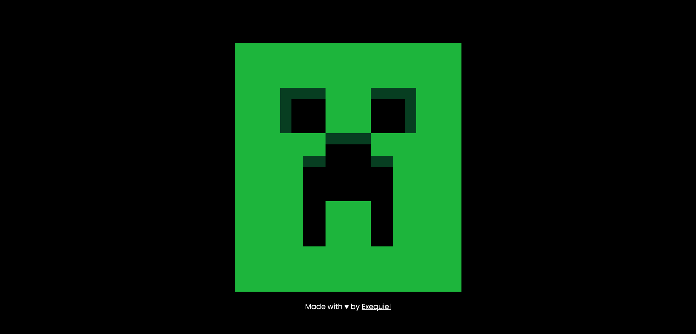

# Minecraft Creeper face - CSS Art

A simple Food Card UI component.

## Table of contents

- [Overview](#overview)
  - [The challenge](#the-challenge)
  - [Screenshot](#screenshot)
  - [Links](#links)
- [My process](#my-process)
  - [Built with](#built-with)
- [Author](#author)

## Overview

### The challenge

Users should be able to:

- View a simple Minecraft creeper face

### Screenshot

### Links

- Live Site URL: 

## My process

### Built with

- HTML
- CSS

## Author

- GitHub - [quielLovesLasagna](https://github.com/quielLovesLasagna)
